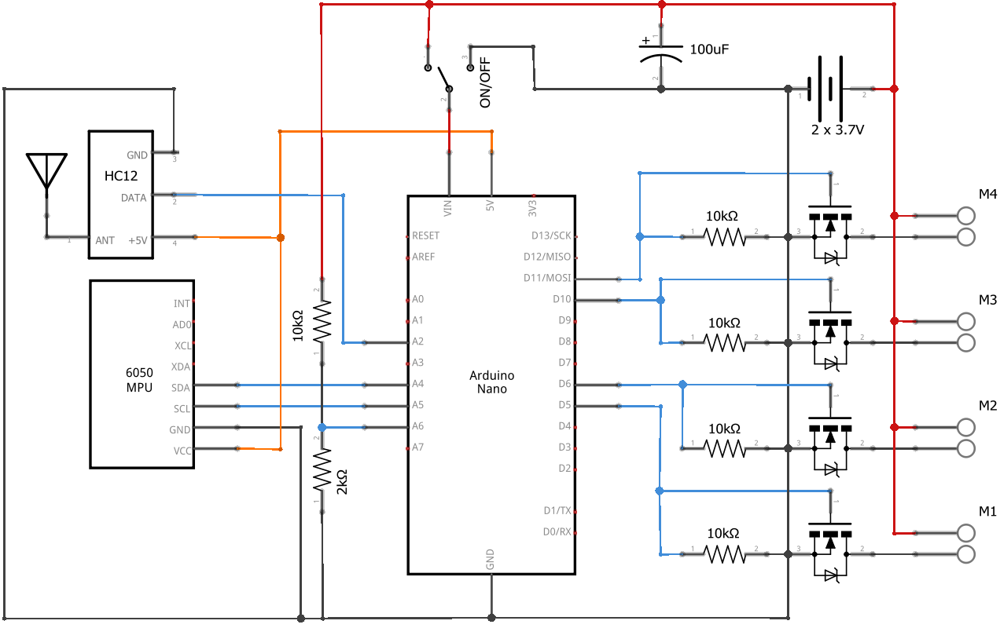

# Drone-arduino
Drone quadcopter using Arduino Nano microcontroller

**Note:** This is a work in progress, not stable yet

**License:** See the LICENSE file

**Author:** Romain JL. Fétick (Toulouse, France)

## Introduction

The project consists in buiding from scratch a quadcopter drone and its remote control. 
The drone frame is 20 cm large and propeller radius is 6.5 cm. 
The total mass is 130g, the 2*3.7V batteries included. 
It is powered by four DC brushed motors.
The core of the drone is an Arduino Nano, connected to:
- a HC12 radio transmitter to receive commands from the remote control
- a MPU6050 accelerometer to measure the drone state
- four MOSFET transistors to send power to the motors
- the batteries for power supply
- a voltage divider circuit for battery monitoring

{width=50%}
